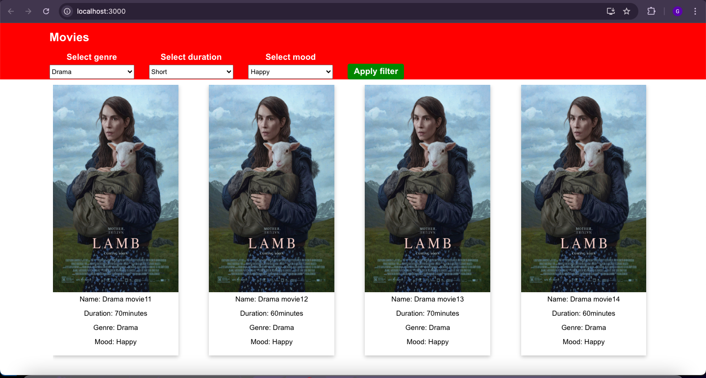

# Movie website

---

## This is a small movie projects. I used MERN stack to build this project.

Backend repo link of this project : https://github.com/gulashanhashami/movies_task_backend

# Run Locally

- To run this project locally follow following steps below
- Create folder in your local system

Clone this Project

`git pull https://github.com/gulashanhashami/movie_task_frontend`

# npm run start
- Now the project is ready just go and visit home page

- > HOME PAGE

# What did I Learn

- Effective learning involves how I was able to debug before we present our project.
